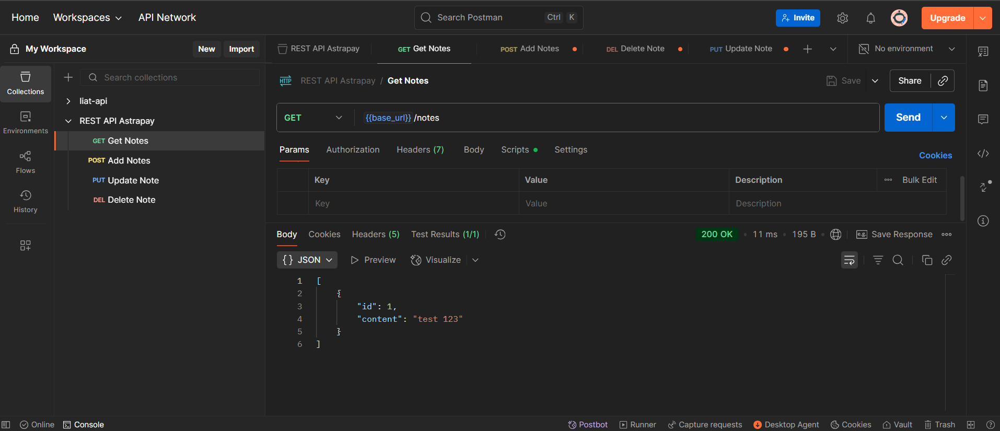
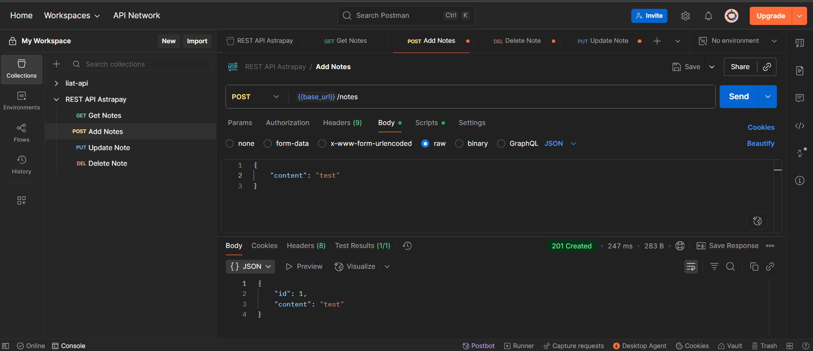
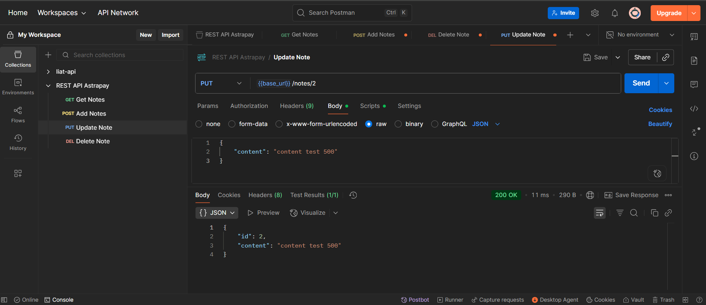
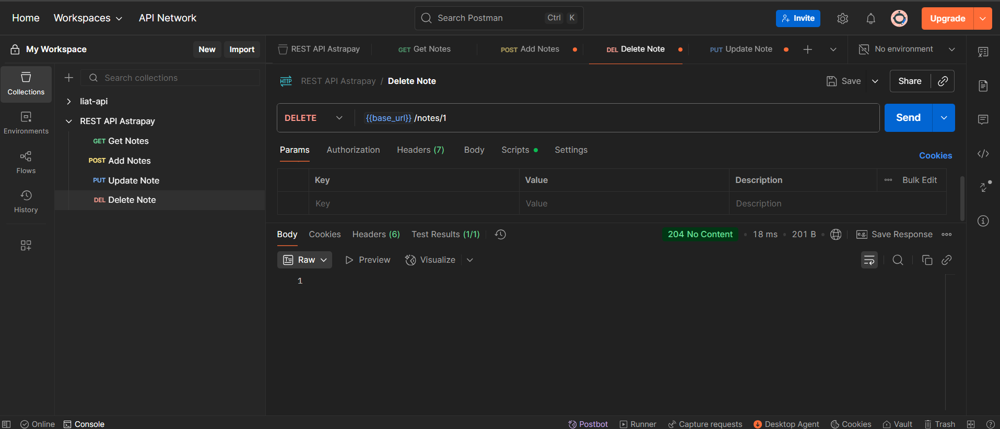
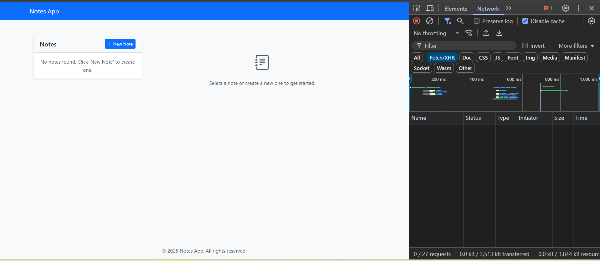
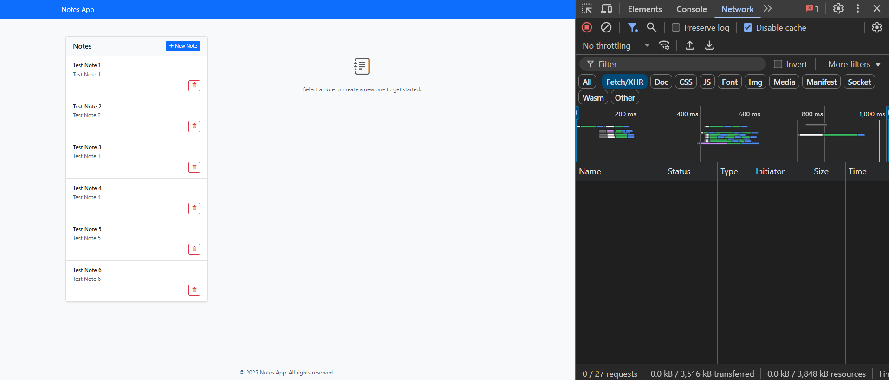
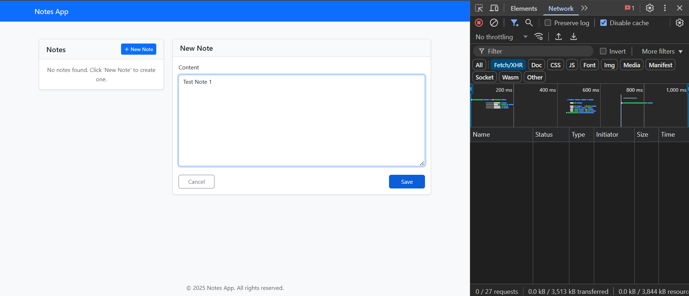
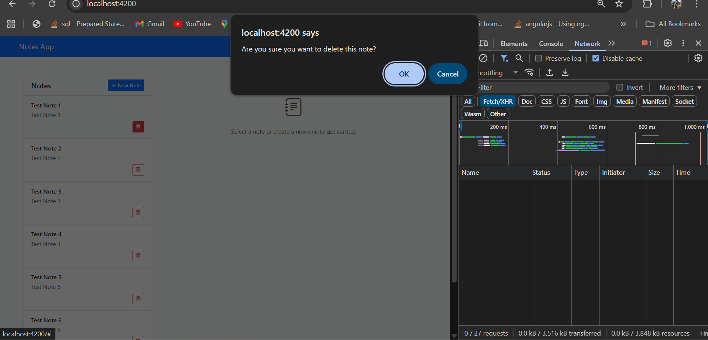

# Notes Application

A full-stack notes application with a Spring Boot backend and Angular frontend, following Astrapay's conventions.

## 🚀 Prerequisites

### Backend

- Java 11 or higher
- Maven 3.6.3 or higher

### Frontend

- Node.js 16.x or higher
- npm 8.x or higher (comes with Node.js)
- Angular CLI 17.x

### Development Tools

- Your favorite IDE (IntelliJ IDEA, VS Code, etc.)

## 📦 Dependencies

### Backend

- **Spring Boot 2.7.18**
  - spring-boot-starter-web
  - spring-boot-starter-validation
  - spring-boot-starter-data-jpa
- **Lombok** - For reducing boilerplate code
- **SpringFox Swagger** - For API documentation
- **H2 Database** - In-memory database (for development)

### Frontend

- **Angular 17**
- **Bootstrap 5** - For responsive design
- **RxJS** - For reactive programming
- **Bootstrap Icons** - For UI icons

## 🛠️ Installation

1. Clone the repository:

   ```bash
   git clone [repository-url]
   cd astrapay-spring-boot-external
   ```

2. Backend setup:

   ```bash
   # Build the project
   mvn clean install
   ```

3. Frontend setup:

   ```bash
   # Navigate to frontend directory
   cd frontend

   # Install dependencies
   npm install
   ```

## 🚀 Running the Application

### Backend

#### Running with Maven

```bash
# From project root
mvn spring-boot:run
```

The backend will start on `http://localhost:8000`

### Frontend

#### Development Server

```bash
# From the frontend directory
cd frontend
ng serve
```

The frontend will be available at `http://localhost:4200`

#### Production Build

```bash
# From the frontend directory
cd frontend
ng build --configuration=production
```

The build artifacts will be stored in the `dist/` directory.

## 💻 Development Workflow

1. Start the backend server:

   ```bash
   # In the project root
   mvn spring-boot:run
   ```

2. In a separate terminal, start the frontend development server:

   ```bash
   # In the frontend directory
   cd frontend
   ng serve
   ```

3. The application will be available at `http://localhost:4200`

## 📦 Environment Configuration

### Backend

- The backend runs on port 8080 by default
- Configure database settings in `src/main/resources/application.properties`

### Frontend

- The frontend runs on port 4200 by default
- API base URL is configured in `frontend/src/app/services/note.service.ts`
- Environment-specific settings can be configured in `frontend/src/environments/`

## 📝 API Endpoints

- `GET /notes` - Get all notes
- `POST /notes` - Create a new note
- `PUT /notes/{id}` - Update a note
- `DELETE /notes/{id}` - Delete a note

## 🧪 Testing

Run the tests using:

```bash
mvn test -X
```

### Project Structure

```
frontend/
├── src/
│   ├── app/
│   │   ├── components/     # Reusable components
│   │   ├── services/       # API services
│   │   ├── models/         # TypeScript interfaces
│   │   ├── app.component.* # Root component
│   │   └── app.module.ts   # Root module
│   ├── assets/            # Static assets
│   └── environments/      # Environment configurations
└── angular.json           # Angular CLI configuration
```

## 📦 Project Structure

```
com.astrapay
├── config           # Configuration classes
├── controller       # REST controllers
├── dto              # Data Transfer Objects
├── entity           # JPA entities
├── exception        # Custom exceptions and handlers
├── repository       # Data access layer
└── service          # Business logic layer
```

## Screenshots

### GET Notes
- **Success**
  

### POST Note
- **Success**
  

- **Bad Request (Validation Fail)**
  

### PUT Note
- **Success**
  

- **Bad Request (Validation Fail)**
  

- **Not Found**
  

### DELETE Note
- **Success**
  

- **Not Found**
  

---

### 🎨 UI (Frontend)

#### Empty List


#### Notes List (6 Notes)


#### Note Form


#### Delete Note Confirmation
